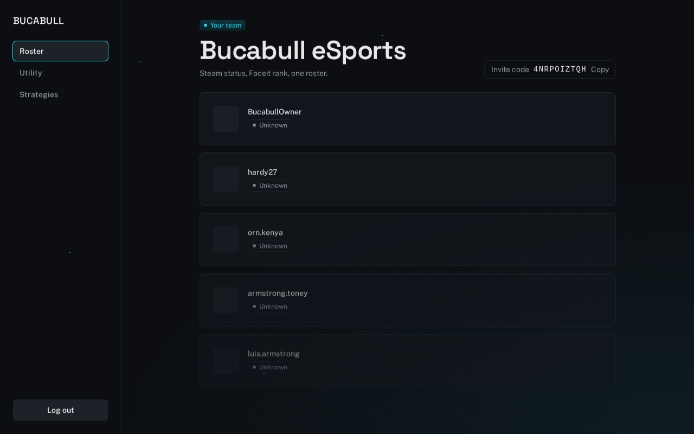
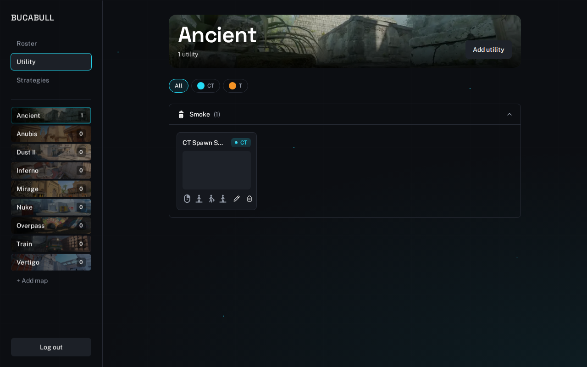

Bucabull is a Counter-Strike team platform: Steam-linked roster status,
Faceit rank, and a shared utility (grenade lineup) library, built as an
independent, open, self-hostable alternative to closed team-management
tools. It's licensed [AGPL-3.0](LICENSE) specifically so it stays that
way — anyone can run it, fork it, or build on it, as long as improvements
stay open too.

<p>
  
  
  
</p>




## What's here today

- **Steam-only auth** — sign in with Steam, no separate account/password to manage.
- **Roster** — every teammate's Steam online status and Faceit rank, refreshed on a schedule, in one page.
- **Utility library** — per-map grenade lineups: setpos, side, throw button, stance/movement/jump, up to 3 screenshots, filterable by side and type.
- **Self-service teams** — anyone can create a team or join one with an invite code. Nothing is console-assigned.

Strats and a tactics board are planned but not built yet — see [open issues](https://github.com/FrederikStenbergPedersen/bucabull/issues) for what's next.

## Stack

Laravel 12 + Inertia.js + React (TypeScript) + Tailwind CSS v4, PostgreSQL.
The UI is a from-scratch component library (`packages/ui`, browsable via
Storybook) — pages are built from it, not raw Tailwind, so the product
stays visually coherent as more contributors add to it.

## Getting started

**Requirements:** PHP 8.2+, Node 22+, Composer, Docker (for local Postgres).

```bash
git clone https://github.com/FrederikStenbergPedersen/bucabull.git
cd bucabull

composer install
npm install

cp .env.example .env
php artisan key:generate

docker compose up -d          # Postgres on localhost:5432
php artisan migrate
php artisan db:seed           # a fake team + roster to look at

npm run dev                   # Vite, in one terminal
php artisan serve             # http://localhost:8000, in another
```

That gets you a browsable app with a seeded fake team. To actually sign
in (Steam auth, needed for anything past the public roster view — creating
a team, adding utility, etc.), add to `.env`:

```env
# Free — https://steamcommunity.com/dev/apikey
STEAM_CLIENT_SECRET=

# Free tier — https://developers.faceit.com (only needed for rank refresh)
FACEIT_API_KEY=
```

Storybook for the component library:

```bash
npm run storybook --workspace=packages/ui   # http://localhost:6006
```

## Testing & linting

```bash
./vendor/bin/pest      # PHP tests
npm run lint            # ESLint (frontend)
npm run format:check    # Prettier (frontend)
vendor/bin/pint         # Laravel Pint (PHP)
```

All of the above run in CI on every pull request.

## Contributing

Feature requests and bugs are tracked as [GitHub issues](https://github.com/FrederikStenbergPedersen/bucabull/issues) —
that's the single source of truth for planned work, not an external
tracker. Pick up an open issue, or open one to propose something before
sending a PR for it.

A few conventions worth knowing before you dive in — the full detail
lives in [`CLAUDE.md`](CLAUDE.md), but the two that matter most:

- **The component library is the only door in.** Don't write raw
  Tailwind-styled JSX in a page — if `packages/ui` doesn't have the
  primitive or pattern you need yet, add it there first (with a
  Storybook story), export it, then consume it from the page.
- **New team-facing tools** go under `resources/js/pages/team/`, wrapped
  in `<TeamLayout>`, with one entry added to `useTeamNav()`.

## License

[AGPL-3.0-only](LICENSE). Run it, fork it, build on it — if you deploy a
modified version as a network service, its source needs to be published
too. See the license file for the exact terms.
